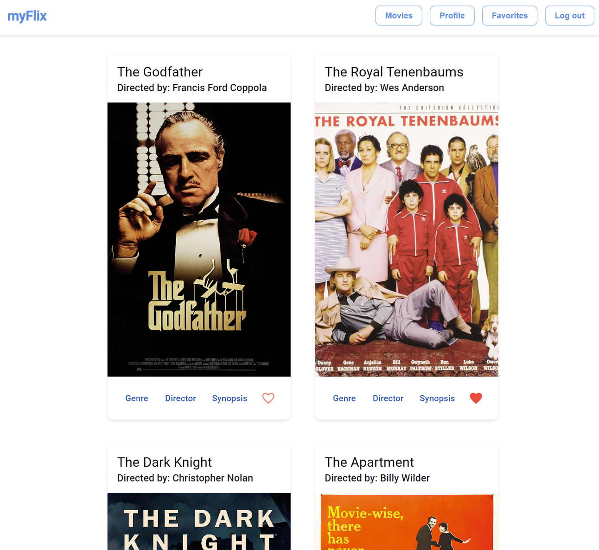

# MyFlix Angular

## Objective

Using Angular, the objective is to build the client-side for the myFlix application based on its existing server-side code, with comprehensive supporting documentation.

## User Stories

- As a user, I want to be able to receive information on movies, directors, and genres so that I can learn more about movies I’ve watched or am interested in.
- As a user, I want to be able to create a profile so I can save data about my favorite movies.

## Key Features

- **Welcome View**: Users can log in or register an account.
- **Main View**: Authenticated users can view all movies.
- **Single Movie View**: Users can see additional movie details and navigate to director and genre views.
- **Director View**: Displays details about the movie's director.
- **Genre View**: Displays details about the movie's genre.
- **User View**: Users can view and update their profile information.
- **Favorite/Unfavorite Movies**: Users can favorite and unfavorite movies.
- **Usar's Favorites View**: Users can view their favorite movies list.

## Technical Requirements

This project was generated with [Angular CLI](https://github.com/angular/angular-cli) version 18.2.1.

## Development server

Run `ng serve` for a dev server. Navigate to `http://localhost:4200/`. The application will automatically reload if you change any of the source files.

## Code scaffolding

Run `ng generate component component-name` to generate a new component. You can also use `ng generate directive|pipe|service|class|guard|interface|enum|module`.

## Build

Run `ng build` to build the project. The build artifacts will be stored in the `dist/` directory.

## Running unit tests

Run `ng test` to execute the unit tests via [Karma](https://karma-runner.github.io).

## Running end-to-end tests

Run `ng e2e` to execute the end-to-end tests via a platform of your choice. To use this command, you need to first add a package that implements end-to-end testing capabilities.

## Further help

To get more help on the Angular CLI use `ng help` or go check out the [Angular CLI Overview and Command Reference](https://angular.dev/tools/cli) page.
